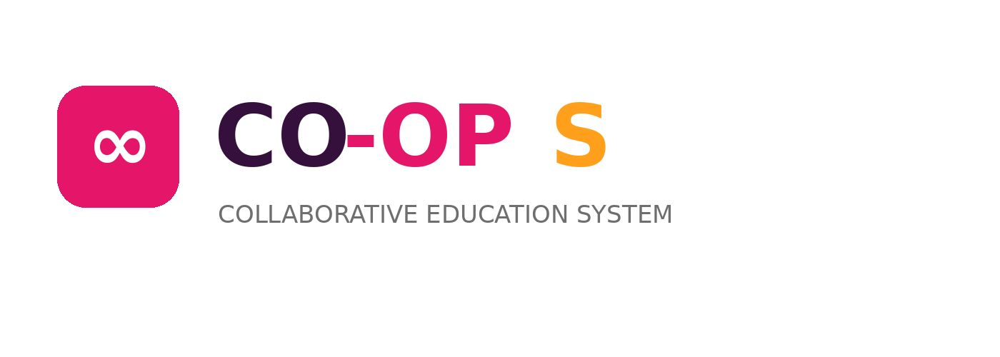

# Coop Training Management System (CTMS) 🎓

  

## Live Prototype

👉 https://alya-shehab.github.io/co-op-training-management-system/prototype/ctms_prototype.html

## Live Demo

👉 https://alya-shehab.github.io/co-op-training-management-system/demo/

---

## Overview

CTMS is a web-based system designed to simplify and organize the cooperative training process for students, supervisors, and administrators.

The platform helps improve communication, report management, training follow-up, and evaluation processes through a modern and user-friendly interface.

---

## User Roles

### Student
- Upload weekly reports
- Track training progress
- View evaluations and feedback
- Receive notifications

### Supervisor
- Review student reports
- Submit evaluations
- Monitor student performance

### Admin
- Manage users
- Assign supervisors
- View reports and statistics

---

## Features

- Responsive modern UI
- Multi-role dashboard system
- Weekly report management
- Evaluation and feedback system
- Notifications and alerts
- Training progress tracking
- Supervisor assignment management
- Reports and statistics section

---

## Technologies Used

- HTML
- CSS
- JavaScript

---

## 📷 Screenshots

### Login Page

### Dashboard

### Reports

### Evaluation System

---

## Demo

The prototype and demo files are included in this repository.

---

## Project Status

Completed as part of a university coursework project.
